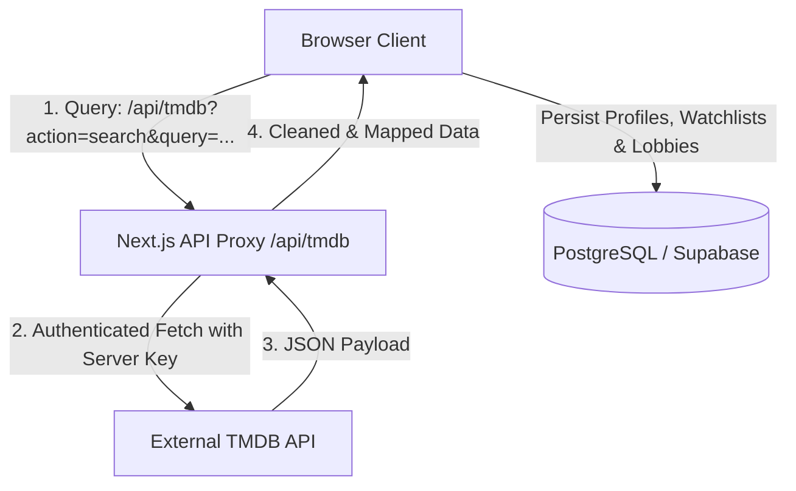

# LumoraX Enterprise Deployment & Technical Guide

This document outlines the system architecture, database schemas, environment variables, security configurations, and deployment procedures for **LumoraX** — an Enterprise-grade AI Entertainment Intelligence Platform.

---

## 1. Technical Architecture

LumoraX is designed with a modern decoupled full-stack architecture built on Next.js 16 (App Router), React, Tailwind CSS, Framer Motion, and Recharts.



### Key Security Decisions
* **API Key Exposure Mitigation**: Next.js client-side applications loading environment variables prefix them with `NEXT_PUBLIC_`, which exposes keys in plain text inside browser bundle networks. LumoraX forces all movie search and detail fetches through a server-side proxy endpoint (`/api/tmdb`), protecting the external credentials.
* **Graceful Degradation / Mock Fallback**: In the event that upstream TMDB API endpoints fail, trigger rate limits, or encounter DNS timeouts, the API Route Handler serves structured mock fallbacks to keep the client interface fully functional.

---

## 2. Environment Variables

Configure these variables in a `.env.local` file in the project root for local development, or add them directly to your hosting provider's dashboard (e.g., Vercel, Netlify):

```env
# TMDB API Configuration (Server-side exclusive)
TMDB_API_KEY=c615c9a97c20eeb1a3412c2aa373fc9d

# Supabase Authentication & Database Configuration (Required for Live Sync)
NEXT_PUBLIC_SUPABASE_URL="your-supabase-project-url-goes-here"
NEXT_PUBLIC_SUPABASE_ANON_KEY="your-supabase-anon-key-goes-here"
```

---

## 3. Database Schema (Supabase PostgreSQL)

If migrating from simulation states to a live database, use the following SQL schema inside your Supabase SQL editor to provision the profile tables and automatic triggers:

```sql
-- User Profiles Table (Synchronized with Supabase auth.users)
CREATE TABLE IF NOT EXISTS public.profiles (
    id UUID PRIMARY KEY REFERENCES auth.users(id) ON DELETE CASCADE,
    email TEXT UNIQUE NOT NULL,
    full_name TEXT,
    avatar_url TEXT,
    phone_number TEXT,
    career_track TEXT,
    favorite_genres TEXT[] DEFAULT '{}',
    skills_of_interest TEXT[] DEFAULT '{}',
    onboarded BOOLEAN DEFAULT FALSE,
    updated_at TIMESTAMP WITH TIME ZONE DEFAULT CURRENT_TIMESTAMP
);

-- Watchlist Table
CREATE TABLE IF NOT EXISTS public.watchlist (
    id BIGSERIAL PRIMARY KEY,
    user_id UUID REFERENCES public.profiles(id) ON DELETE CASCADE,
    movie_id TEXT NOT NULL,
    title TEXT NOT NULL,
    backdrop_url TEXT,
    rating NUMERIC(3, 1),
    created_at TIMESTAMP WITH TIME ZONE DEFAULT CURRENT_TIMESTAMP,
    UNIQUE(user_id, movie_id)
);

-- Favorites Table
CREATE TABLE IF NOT EXISTS public.favorites (
    id BIGSERIAL PRIMARY KEY,
    user_id UUID REFERENCES public.profiles(id) ON DELETE CASCADE,
    movie_id TEXT NOT NULL,
    title TEXT NOT NULL,
    created_at TIMESTAMP WITH TIME ZONE DEFAULT CURRENT_TIMESTAMP,
    UNIQUE(user_id, movie_id)
);

-- Automatic Profile Creation Trigger on Sign-Up
CREATE OR REPLACE FUNCTION public.handle_new_user()
RETURNS trigger AS $$
BEGIN
  INSERT INTO public.profiles (id, email, full_name, avatar_url, phone_number)
  VALUES (
    new.id,
    new.email,
    COALESCE(new.raw_user_meta_data->>'full_name', new.raw_user_meta_data->>'name'),
    new.raw_user_meta_data->>'avatar_url',
    new.phone
  )
  ON CONFLICT (id) DO NOTHING;
  RETURN new;
END;
$$ LANGUAGE plpgsql SECURITY DEFINER;

CREATE OR REPLACE TRIGGER on_auth_user_created
  AFTER INSERT ON auth.users
  FOR EACH ROW EXECUTE FUNCTION public.handle_new_user();
```

---

## 4. Local Development Setup

Follow these commands to configure, install, and execute LumoraX locally:

### Prerequisites
* **Node.js**: v18.0.0 or higher
* **npm**: v9.0.0 or higher

### Installation & Initialization
1. Clone the project files into your local directory.
2. In the root directory, create a `.env.local` file and verify your TMDB key:
   ```bash
   NEXT_PUBLIC_TMDB_API_KEY=c615c9a97c20eeb1a3412c2aa373fc9d
   TMDB_API_KEY=c615c9a97c20eeb1a3412c2aa373fc9d
   ```
3. Run package installations:
   ```bash
   npm install
   ```
4. Start the Next.js development server:
   ```bash
   npm run dev
   ```
5. Open your browser and navigate to [http://localhost:3000](http://localhost:3000).

---

## 5. Production Deployment (Vercel)

Next.js projects deploy seamlessly to Vercel with automatic serverless functions provisioning.

### Steps to Deploy:
1. Push your local repository to a remote Git hosting provider (GitHub, GitLab, Bitbucket).
2. Connect your Git account to Vercel and import the repository.
3. Under **Project Settings -> Environment Variables**, add the server key:
   * **Key**: `TMDB_API_KEY`
   * **Value**: `c615c9a97c20eeb1a3412c2aa373fc9d`
4. Click **Deploy**. Vercel will automatically build the static assets, optimize images, and deploy serverless route functions for `/api/tmdb`.

---

## 6. Algorithmic Matching Reference

* **Jaccard Index (Friend lobby matches)**: Calculated on the intersection of selected genres/moods divided by the union of all group parameters:
  $$\text{Match Percentage} = \frac{|A \cap B|}{|A \cup B|} \times 100$$
* **Cosine Similarity (Scene search embeddings)**: Simulates local term frequency matrices to capture semantic alignment between user queries and raw narrative overview indices.
